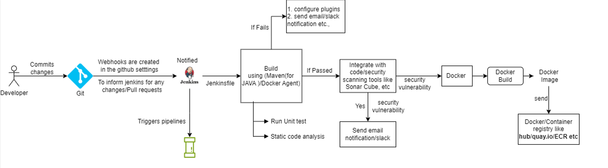

Continuous Integration (CI): 
* It ensure your build is smooth.
* Ensures all tests are executed.
* The code quality is maintained.

Continuous Delivery (CD):
* Ensures that deployment/delivery is done (using Kubernetes(K8S), etc).

## Flow:

## CI:

* Developers store the code in the git repository and then there is an orchestrator (jenkins, etc) which is responsible for watching the commits/pull onto this repo.

* Whenever there is any changes/update/commit/pull then the orchestrator (Jenkins) get notified, because we will setup the webhooks in the github to get notified.

* Upon activation, these webhooks ask jenkins to trigger the pipeline.

* Jenkins file is created to perform a set of action on jenkins like, build the application

.