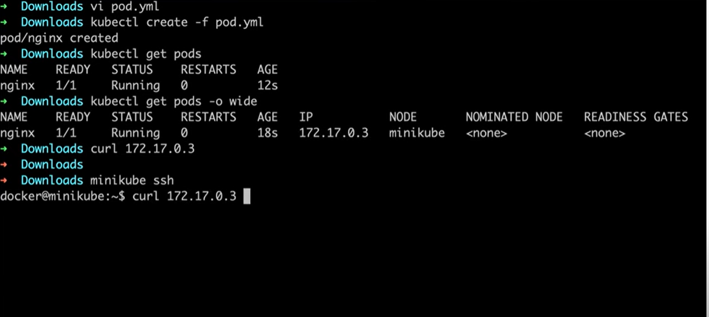

### Kubernetes

## Installation steps for Linux

## Install Kubectl
```
curl -LO "https://dl.k8s.io/release/$(curl -L -s https://dl.k8s.io/release/stable.txt)/bin/linux/amd64/kubectl"
```

## Install Minicube
```
curl -LO https://storage.googleapis.com/minikube/releases/latest/minikube-linux-amd64
sudo install minikube-linux-amd64 /usr/local/bin/minikube
```
## Check if Minikube os installed
```
minikube
```

**Minikube is a command line tool that allows us to create a kubernetes cluster**


## To start minukube cluster
```
minukube start
```
**Note: For the windows/mac/machine users, minikube first creates a VM to start a cluster, this use the below command in those cases**

```
minikube start --memory=4096 --driver=hyperkit
```

## To check minikube nodes running
```
kubectl get nodes
```

## Create your pod.yml file and write the drcription accordingly
```
apiVersion: v1
kind: Pod
metadata:
  name: nginx
spec:
  containers:
  - name: nginx
    image: nginx:1.14.2
    ports:
    - containerPort: 80
```

## To create a pod use  the below commands:
```
kubectl create -f pod.yml
kubectl apply -f pod.yml
```

## To check the pods use below command
```
kubectl get pods
```
**To print the entire detail of the pod, use he below command**
```
kubectl get pods -o wide
```

\

After this we login to our remote kubernetes cluster
ssh -i <identity file> <node name> <Ip Address> 


**To see all the details of the created pod, use the below command to debug and check deep insight of the pod**

```
kubectl describe pod 'podname'
kubectl logs 'podname'
```
**To list out all the available resources in a particular namespace we use the below command**
```
kubectl get all
```
**For all the namespaces we can use**
```
kubectl get all -A
```
**To watch the pods, we use below command**
```
kubectl get pods -w
```

**To see the replica sets**
```
kubectl get rs
```

### Questions:
* Difference between containers, pods and deployment
* Difference between deployment and Replica Set
