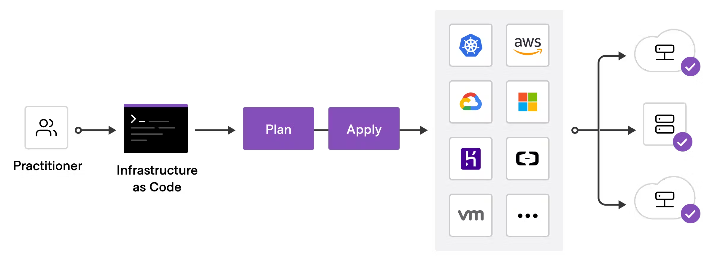

## Install Terraform

**To deploy infrastructure with Terraform:**

**Scope** - Identify the infrastructure for your project.\
**Author** - Write the configuration for your infrastructure.\
**Initialize** - Install the plugins Terraform needs to manage the infrastructure.\
**Plan** - Preview the changes Terraform will make to match your configuration.\
**Apply** - Make the planned changes.

Linux: 
1. sudo apt-get update\
2. sudo apt-get install -y gnupg software-properties-common